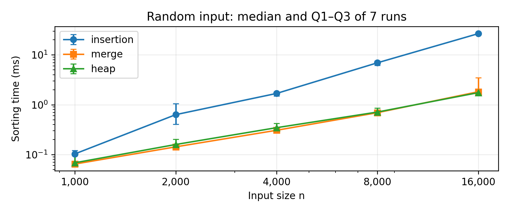
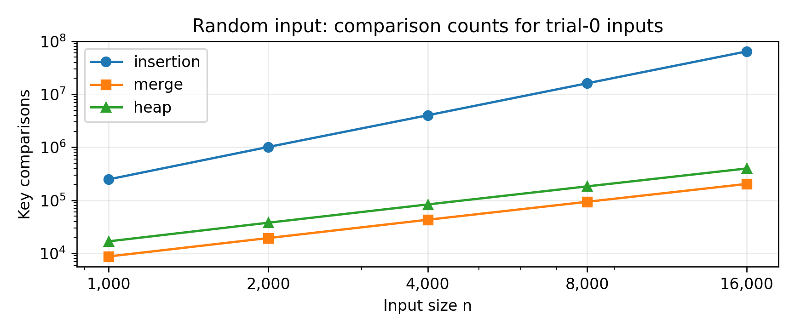

# 삽입·병합·힙 정렬 비교

고급알고리즘 과제 1  |  구현 및 실험 보고서

| 학번 / 이름 | 실험일 |
| --- | --- |
| 2026193114 / 이현재 | 2026년 9월 30일 |

| GitHub 저장소 URL (필수) |
| --- |
| GITHUB_REPOSITORY_URL |

위 입력란은 제출 전에 본인 저장소 주소로 채워야 합니다. 교수자 샘플 저장소 주소는 제출용 URL이 아닙니다.

## 1. 비교 목적과 알고리즘 선정

수업에서 배운 정렬 중 삽입 정렬과 병합 정렬을 선택하고, 안내문에 제시된 학습 목록에 없는 힙 정렬을 추가하였다. 삽입 정렬은 입력이 이미 얼마나 정렬되어 있는지에 따른 차이를 관찰하기 좋고, 병합 정렬과 힙 정렬은 같은 O(n log n) 계열이면서도 추가 공간과 안정성에서 차이가 있어 비교 대상으로 정하였다. [1, 3–6]

### 1.1 이론적 특성

| 정렬 | 최선 시간 | 평균 시간 | 최악 시간 | 추가 공간 | 안정성 |
| --- | --- | --- | --- | --- | --- |
| 삽입 | O(n) | O(n²) | O(n²) | O(1) | 안정 |
| 병합 | O(n log n) | O(n log n) | O(n log n) | O(n) | 안정 |
| 힙 | O(n)* | O(n log n) | O(n log n) | O(1) | 불안정 |

구현 기준 비교입니다. 병합 정렬은 이미 정렬된 구간을 건너뛰는 최적화를 사용하지 않았습니다. 힙 정렬의 *는 같은 값에서 내려가기를 중단하는 이번 구현에 모든 key가 같은 입력을 주었을 때의 최선입니다. 서로 다른 key만 허용하면 일반적인 이진 힙 정렬의 최선도 Θ(n log n)입니다. [4, 5]

### 1.2 관찰할 질문

첫째, 원소 수가 증가할 때 세 정렬의 시간이 어떻게 달라지는가? 둘째, 이미 정렬된 입력·역순 입력·중복 입력에서 순위가 달라지는가? 셋째, 속도만 보고 선택했을 때 놓치는 메모리 사용량과 안정성의 차이는 무엇인가?

### 1.3 결과 요약

16,000개 무작위 입력의 중앙값은 삽입 26.670 ms, 병합 1.819 ms, 힙 1.746 ms였다. 반면 정렬된 입력에서는 삽입 정렬이 0.016 ms로 가장 빨랐다. 병합과 힙의 작은 시간 차이는 측정 편차를 고려해 해석해야 하며, 어느 한 정렬이 항상 가장 빠르다고 결론 내릴 수는 없다.

실측 자료: results/raw_timings.csv, summary.csv, counts.csv. 이 보고서의 실행 결과는 AI 지원 Linux 환경에서 얻었으며 제출자 PC의 측정 결과로 표시하지 않았다.


---

## 2. 코드 구성과 검증

### 2.1 공통 자료형과 호출 방식

정렬 대상은 정수 key와 입력 당시 위치 original_index를 함께 가진 Item이다. 비교는 key만 사용하고 위치 정보는 안정성·원소 보존을 검사하는 데만 사용한다. 각 정렬의 함수 형식이 같으므로 같은 측정 코드로 세 정렬을 실행할 수 있다.

```c
typedef struct {
    int key;
    uint32_t original_index;
} Item;

typedef int (*SortFunction)(Item *, size_t, SortStats *);
```

| 파일 | 역할 |
| --- | --- |
| src/insertionSort.c | 큰 값을 오른쪽으로 밀고 현재 원소를 삽입 |
| src/mergeSort.c | 구간을 반으로 나누어 재귀 정렬한 뒤 병합 |
| src/heapSort.c | 최대 힙 구성, 최댓값 이동, siftDown 반복 |
| src/sort.h, sort.c | 공통 자료형, 카운터, 정렬 함수 목록 |
| src/data.c, main.c | 입력 생성, 시간 측정, 정답·안정성 확인 |
| tests/test_sort.c | 전수·난수·경계값·안정성·카운터 검사 |
| tools/, results/, report/ | 집계 도구, 실측 원본, 보고서 및 그래프 |

### 2.2 구현에서 주의한 부분

삽입 정렬은 이전 값이 현재 값보다 클 때만 이동한다. 병합 정렬은 같은 값이면 왼쪽 구간 원소를 먼저 가져온다. 이 조건으로 같은 key의 입력 순서를 보존한다. 힙 정렬은 재귀 대신 반복문을 사용하며, 배열 밖 자식에 접근하지 않도록 경계를 먼저 검사한다.

정렬 함수는 정상 종료 시 1, 잘못된 입력이나 보조 배열 할당 실패 시 0을 반환한다. 빈 배열은 허용한다. 병합 정렬은 크기 계산의 넘침 여부와 malloc 결과를 확인하고, 한 번 확보한 보조 배열을 재사용한 뒤 해제한다.

### 2.3 실제 검증 결과

```c
SORT_COUNTING=1: 11980 checks, 0 failures
SORT_COUNTING=0: 11976 checks, 0 failures
ASan + UBSan:   11980 checks, 0 failures
```

기본 10가지 사례, {-1, 0, 1}로 구성한 길이 0~7의 모든 배열, 난수 배열, 2의 거듭제곱 전후 크기를 검사하였다. 표준 qsort로 만든 기준 결과와 key를 대조하고, 각 original_index가 한 번씩만 나타나는지 확인하여 원소 누락·중복도 검사하였다. 안정 정렬은 동률의 입력 순서까지 확인했다.

검증 근거: results/test_log.txt, sanitizer_log.txt. 두 빌드의 검사 수 차이 4개는 카운터 전용 검사 때문이다. 통과는 검사한 범위의 결과이며 모든 실행 환경에 대한 무결함 증명은 아니다.


---

## 3. AI 학습 자료: 힙 정렬의 동작

과제의 “배우지 않은 정렬에 대한 AI 학습 내용 첨부”에 해당한다. 아래는 이번 과제를 위해 AI가 생성한 학습용 문답과 예시이며, 기존 대화를 그대로 옮긴 기록은 아니다. 원리 설명은 [5, 6]과 대조하였다.

### 질문 1. 힙은 무엇이며 배열로 어떻게 나타내나요?

AI 답변: 힙은 부모와 자식 사이의 대소 관계를 유지하는 완전 이진 트리이다. 최대 힙에서는 모든 부모의 값이 자식의 값 이상이므로 가장 큰 값이 루트에 있다. 같은 깊이에 있는 두 값 사이까지 정렬되어 있을 필요는 없다. 완전 이진 트리를 배열에 차례로 놓으면 별도 노드나 포인터 없이 표현할 수 있다.

인덱스를 0부터 사용할 때, 부모가 i이면 왼쪽 자식은 2i+1, 오른쪽 자식은 2i+2이다. 자식 i의 부모는 i>0에서 (i-1)/2의 정수 나눗셈으로 구한다. 아래 괄호 안 숫자는 배열 인덱스이다.

```c
              5 (0)
             /     \
          4 (1)   3 (2)
          /   \
       2 (3) 1 (4)

array: [5, 4, 3, 2, 1]
```

### 질문 2. 가장 큰 값을 꺼내는데 왜 오름차순이 되나요?

AI 답변: 최댓값을 결과의 맨 앞에 놓는 것이 아니라 배열 맨 뒤에 놓기 때문이다. 루트와 현재 힙의 마지막 원소를 바꾸고, 마지막 칸을 힙 범위에서 제외한다. 그러면 뒤쪽에는 큰 값부터 제자리가 확정되고, 앞쪽의 남은 힙에 같은 작업을 반복하여 전체가 오름차순이 된다.

### 질문 3. 배열 [4, 1, 3, 2, 5]를 직접 따라가면?

| 단계 | 아직 정렬 중인 힙 구간 | 확정 구간 |
| --- | --- |
| 입력 | [4, 1, 3, 2, 5] | [] |
| 최대 힙 구성 | [5, 4, 3, 2, 1] | [] |
| 5를 뒤로 이동하고 복구 | [4, 2, 3, 1] | [5] |
| 4를 뒤로 이동하고 복구 | [3, 2, 1] | [4, 5] |
| 3을 뒤로 이동하고 복구 | [2, 1] | [3, 4, 5] |
| 마지막 교환 | [1] | [2, 3, 4, 5] |

siftDown은 두 자식 중 큰 자식과 부모를 비교한다. 자식이 더 크면 교환하고 그 자식 위치에서 계속 내려간다. 부모가 이미 자식 이상이면 중단한다. 위 표는 제출 코드의 교환 순서에 맞춰 추적한 예이다.


---

## 4. AI 학습 자료: 복잡도와 안정성

### 질문 4. 힙 정렬은 왜 O(n log n)인가요?

AI 답변: 완전 이진 트리의 높이는 O(log n)이므로 siftDown 한 번은 최악에 O(log n)이다. 최댓값을 뒤로 보내는 작업을 최대 n-1번 반복하여 정렬 단계는 O(n log n)이 된다. 이때 힙 전체를 매번 새로 만드는 것이 아니라 루트에서 내려가는 한 경로만 고친다는 점이 중요하다. [5, 6]

### 질문 5. 처음 힙을 만드는 비용도 O(n log n)인가요?

AI 답변: 아래에서 위로 구성하면 O(n)이다. 리프는 내려갈 필요가 없고, 많은 노드는 바닥 가까이에 있어 조금만 이동한다. 높이 h에 해당하는 노드 수가 대략 n/2^(h+1)로 줄어들므로, 전체 작업량은 n에 수렴하는 급수의 상수를 곱한 정도로 제한된다. 따라서 모든 노드에 최대 높이 log n을 일괄 곱하는 계산은 느슨한 상한이다. [5]

```c
buildHeap cost <= constant * n * sum(h / 2^(h+1))
                                         h >= 0
                = O(n)
Total = O(n) + O(n log n) = O(n log n)
```

### 질문 6. 힙 정렬의 추가 공간과 안정성은 어떤가요?

AI 답변: 이번 반복문 구현은 입력 배열 안에서 교환하므로 보조 배열이 필요 없고 추가 공간이 O(1)이다. 반면 안정 정렬은 아니다. 안정성이란 같은 key의 원소끼리 기존 순서가 유지되는 성질이다. 멀리 떨어진 루트와 마지막 원소를 교환하면 같은 key의 상대 순서가 바뀔 수 있다. [5, 6]

| 알고리즘 | (2,A), (2,B), (1,C)를 key로 정렬한 결과 |
| --- | --- |
| 삽입 | (1,C), (2,A), (2,B) |
| 병합 | (1,C), (2,A), (2,B) |
| 힙 | (1,C), (2,B), (2,A) |

A, B, C는 original_index를 알아보기 쉽게 바꾼 표시이다. 결과는 make run으로 재현된다. key가 모두 다르면 안정성을 구별할 수 없으므로 반드시 중복 key를 사용해야 한다.

### 질문 7. 힙 정렬은 모든 입력에서 반드시 n log n만큼 걸리나요?

AI 답변: 그렇지는 않다. 이 구현은 자식이 부모보다 크지 않으면 즉시 멈춘다. 모든 key가 같으면 각 siftDown이 짧게 끝나므로 전체가 Θ(n)이다. 16,000개 동일값 입력에서 비교 47,994회, 이동 47,997회가 측정되었다. 다만 일반적인 무작위 입력과 최악의 경우에 대한 O(n log n) 특성은 유지된다. [5; 실측 counts.csv]

### 학습 정리

힙 정렬은 “최댓값을 빨리 찾을 수 있는 구조를 유지하면서 뒤쪽부터 정렬을 완성하는 방법”이다. 낮은 추가 공간이 장점이지만, 안정성이 필요하거나 입력이 거의 정렬되어 있는 상황까지 항상 유리한 것은 아니다.


---

## 5. 실험 설계

### 5.1 실행 환경과 입력

| 항목 | 설정 |
| --- | --- |
| 실행 환경 | AI 지원 Linux x86_64 컨테이너, 단일 스레드 |
| CPU | Intel Xeon Platinum 8573C (환경에 표시된 모델명) |
| 컴파일러 | GCC 14.2.0 / C17 / -O2 |
| 입력 자료형 | Item: int key + uint32_t original_index, 이 환경에서 8 bytes |
| 배열 크기 | 1,000 / 2,000 / 4,000 / 8,000 / 16,000개 |
| 반복 횟수 | 조건별 워밍업 1회 후 측정 7회 |

| 입력 형태 | 정확한 생성 방법 |
| --- | --- |
| 무작위 | 32비트 LCG로 생성한 key를 0~1,000,000 범위로 변환 |
| 정렬됨 | 0, 1, 2, …, n-1 |
| 역순 | n, n-1, …, 1 |
| 거의 정렬됨 | 오름차순 배열에서 인접한 두 key를 n/100번 교환 |
| 중복이 많음 | 0~15의 16가지 key를 난수로 배치 |
| 모두 같은 값 | 모든 key를 7로 설정 |

seed는 기본값 20260930과 크기·입력 형태·반복 번호로 정해진다. 한 반복 안에서는 세 정렬에 완전히 같은 입력을 복사해 제공한다. 실행 순서는 반복마다 순환시켜 특정 정렬이 항상 먼저 실행되는 것을 피했다. seed는 각 원본 CSV 행에 기록했다.

### 5.2 측정 범위와 지표

시간은 Linux의 CLOCK_MONOTONIC으로 정렬 함수 호출 직전부터 직후까지 측정하였다. 입력 생성·복사·정답 생성·결과 검증·출력은 제외하였다. 병합 정렬 내부의 보조 배열 malloc/free는 정렬에 필요한 작업이므로 포함하였다.

시간 측정용 빌드는 SORT_COUNTING=0으로 비교·이동 카운터 증가 코드를 제거하였다. 횟수는 SORT_COUNTING=1인 별도 실행 파일로 각 조건의 첫 측정 seed만 다시 실행하여 구했다. 따라서 보고서의 횟수는 7회의 평균이 아니라 정해진 한 입력의 정확한 횟수이다.

시간 대표값은 7회의 중앙값이다. 그래프의 오차 막대는 중앙값을 제외한 아래 3개와 위 3개의 중앙값(Q1~Q3)을 나타낸다. 이는 신뢰구간이 아니다. 실측값은 모두 양수였고, 630회(5크기×6형태×3정렬×7반복)의 정렬·원소 보존 검사도 모두 통과했다.

비교 횟수는 key의 대소 비교 한 번, 이동 횟수는 Item 한 개의 대입 한 번으로 정의한다. 교환은 임시 변수까지 포함해 이동 3회이다. 동적 보조 배열 bytes는 정렬 내부 할당만 집계하며 호출 스택과 벤치마크의 공통 입력 배열은 포함하지 않는다.


---

## 6. 실행 시간 비교

### 6.1 입력 형태별 결과: n = 16,000

| 입력 형태 | 삽입 (ms) | 병합 (ms) | 힙 (ms) |
| --- | --- | --- | --- |
| 무작위 | 26.670 | 1.819 | 1.746 |
| 정렬됨 | 0.016 | 0.329 | 0.881 |
| 역순 | 69.955 | 0.587 | 1.103 |
| 거의 정렬됨 | 0.018 | 0.361 | 0.949 |
| 중복이 많음 | 28.897 | 1.212 | 1.718 |
| 모두 같은 값 | 0.016 | 0.348 | 0.059 |

각 값은 7회 실측 중앙값이며 표시만 소수 셋째 자리로 반올림했다. 전체 정밀도·Q1·Q3·최솟값·최댓값은 results/summary.csv에 있다.

### 6.2 입력 크기에 따른 무작위 입력의 변화



그림 1. 무작위 입력의 시간 중앙값과 Q1~Q3. 두 축 모두 로그 축이다. 점 사이의 선은 측정 지점의 연결이며 중간 크기를 별도로 측정한 결과는 아니다.

무작위 입력 16,000개에서 삽입 정렬은 병합보다 약 14.7배, 힙보다 약 15.3배 오래 걸렸다. 8,000개에서 16,000개로 늘릴 때 삽입 시간은 약 3.85배가 되어 이차 증가 경향과 부합하였다.

이미 정렬되었거나 인접 원소만 조금 바뀐 입력에서는 삽입 정렬의 이동이 적어 가장 빨랐다. 역순에서는 모든 이전 원소를 밀어야 하므로 시간이 크게 늘었다. 모든 key가 같은 경우에는 삽입과 힙의 조기 중단이 드러났다.

무작위 16,000개에서 병합과 힙의 중앙값 차이는 약 0.073 ms이고 Q1~Q3 구간이 겹친다. 이 7회 측정만으로 힙이 병합보다 확실히 빠르다고 일반화하지 않았다. 비교 횟수가 적다고 실제 시간도 반드시 더 짧은 것은 아니다.


---

## 7. 연산 횟수·메모리·안정성 비교

### 7.1 무작위 입력 16,000개: 첫 측정 seed

| 정렬 | key 비교 | 원소 이동 | 동적 보조 배열 |
| --- | --- | --- | --- |
| 삽입 | 64,174,459 | 64,190,473 | 0 B |
| 병합 | 203,236 | 447,232 | 128,000 B |
| 힙 | 397,727 | 627,957 | 0 B |

공통 seed = 2315296450. 0 B는 동적으로 확보한 보조 배열이 없다는 뜻이지 전체 메모리 사용량이 0이라는 뜻은 아니다. 병합에는 이와 별도로 O(log n)의 재귀 호출 스택이 필요하지만 전체 추가 공간은 O(n)이다.



그림 2. 무작위 입력의 첫 seed에 대한 비교 횟수. 두 축 모두 로그 축이며, 시간과 달리 운영체제의 실행 지연에 영향을 받지 않는 코드 수준의 횟수이다.

### 7.2 입력 순서가 만드는 차이

삽입 정렬의 정렬된 입력 비교는 15,999회이다. 역순에서는 1+2+…+15,999 = 127,992,000회로 정확히 8,000배이다. 거의 정렬된 입력은 16,159회로 정렬된 경우와 비슷했다. 따라서 “삽입 정렬은 항상 느리다”가 아니라 입력의 역전 관계가 많을 때 불리하다고 해석해야 한다.

무작위 입력의 병합 비교는 203,236회로 힙의 397,727회보다 적었다. 다만 한 번의 비교 이외에도 데이터 이동, 함수 호출, 할당, 실행 환경의 영향이 있으므로 비교 횟수만으로 시간 차이의 원인을 확정하지 않았다.

### 7.3 공간과 안정성의 선택 기준

병합 정렬의 보조 배열은 16,000×8 = 128,000 bytes이다. 삽입과 힙은 일정한 크기의 지역 변수만 사용한다. 중복 key의 입력 순서는 삽입·병합에서 유지되었고 힙에서는 실제로 바뀌었다. 안정성의 의미를 살리기 위해 original_index를 정렬 비교의 보조 기준으로 넣지 않았다. [3–6; 실측 및 소스 코드]


---

## 8. 결론·한계·재현 방법

이미 정렬되었거나 역전이 매우 적은 입력에는 삽입 정렬이 유리했다. 일반적인 큰 입력에서 안정성을 유지해야 하고 O(n)의 추가 공간을 허용할 수 있다면 병합 정렬이 적합하다. 추가 배열을 피하면서 최악 O(n log n)의 시간 상한을 확보하려는 경우에는 반복문 기반 힙 정렬을 고려할 수 있다. 이번 비교의 핵심은 속도, 입력 특성, 추가 공간, 안정성을 함께 보는 것이다.

### 8.1 실험의 한계와 AI 활용 범위

측정은 한 종류의 가상화된 Linux 실행 환경, 최대 16,000개 Item, 6가지 생성 입력에 한정된다. 스케줄링·캐시·컴파일러의 영향은 분리해서 측정하지 않았다. 7회 중앙값과 사분위수는 이 조건의 관측 요약이며 다른 컴퓨터에서도 같은 ms나 순위가 나온다는 보장은 없다.

AI는 힙 정렬 학습 자료, C 코드·검증 코드 작성, 실행 및 결과 집계, 보고서 초안 작성에 활용하였다. 이 문서의 실측값은 AI 지원 실행 환경에서 실제로 얻은 결과이다. 직접 실행하지 않은 학생 PC·Codespaces의 결과를 실행한 것처럼 표시하지 않았다.

### 8.2 재현 명령과 원본 자료

```c
make test        # correctness and stability
make run         # sorting and stability examples
make bench       # 630 timings + 90 count rows + summary
make sanitize    # AddressSanitizer / UndefinedBehaviorSanitizer
```

GCC·make·Python 3가 있는 환경의 저장소 루트에서 실행한다. 핵심 C 코드와 CSV 집계·SVG 재생성은 외부 라이브러리를 요구하지 않는다. make bench는 CSV를 새 결과로 덮어쓴다. PDF는 기존 실측 보고서이므로 재측정값을 사용할 때 표·그래프·실행 환경도 함께 갱신해야 한다.

### 참고 자료

[1] Wikipedia, Sorting algorithm: Comparison of algorithms. 선정 목록 확인.
https://en.wikipedia.org/wiki/Sorting_algorithm#Comparison_of_algorithms

[2] lec-algorithm, 과제 샘플 보고서. 공통 비교·검증 구조 참고.
https://github.com/lec-algorithm/hw1-sample-2026/blob/main/report/REPORT.md

[3] Sedgewick & Wayne, Algorithms 4e, §2.1 Elementary Sorts.
https://algs4.cs.princeton.edu/21elementary/

[4] Sedgewick & Wayne, Algorithms 4e, §2.2 Mergesort.
https://algs4.cs.princeton.edu/22mergesort/

[5] Sedgewick & Wayne, Algorithms 4e, §2.4 Priority Queues.
https://algs4.cs.princeton.edu/24pq/

[6] NIST Dictionary of Algorithms and Data Structures, heapsort.
https://xlinux.nist.gov/dads/HTML/heapSort.html

[7] lec-algorithm, algorithm-env. 수업의 저장소·실행 환경 안내.
https://github.com/lec-algorithm/algorithm-env

웹 자료 확인일: 2026년 9월 30일. 문헌의 실행 시간을 가져오지 않고 제출 코드로 새로 측정했다. [2]는 보고서 구성의 참고이며 세 정렬과 벤치마크 코드는 이번 과제용으로 작성하였다.
